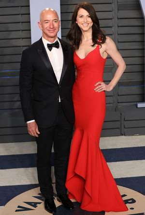
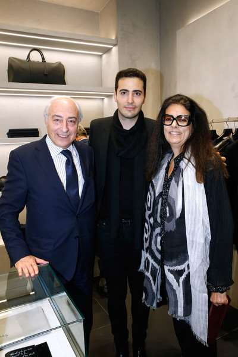
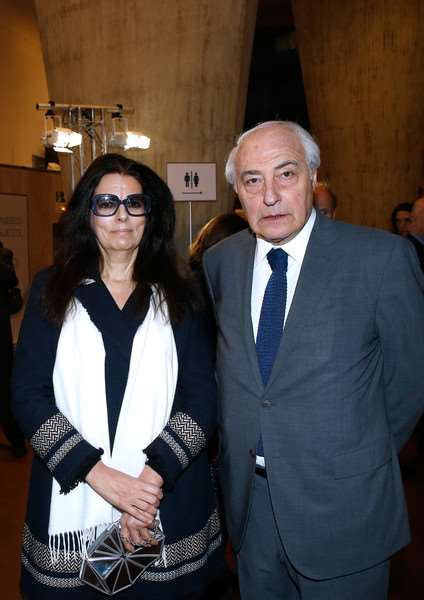
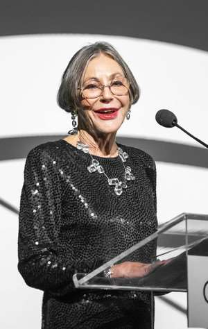

# Style per million: how the wealthiest women in the world dress

The presence of millions in the account does not guarantee the ability to dress in style and relevance. We show what women wear, who left far behind famous male businessmen, and find out who of these ladies achieved heights not only in work, but also in the selection of clothes.

## Mackenzie Bezos

In 2019, Jeff and Mackenzie Bezos - once the richest couple in history - officially dissolved their marriage after 25 years together. Under the terms of the divorce, Mackenzie Bezos retained a $48 billion stake in Amazon, a major technology company headed by her ex-husband, making her the third richest woman in the world at the time.

Since then, the company's fortune has almost doubled amid rising shareholder value. And in 2020, Mackenzie became the richest woman in the U.S., dashingly overtaking influential competitors. True, it is fundamentally wrong to say that Mackenzie is just the ex-wife of a successful man.

In clothes Mackenzie prefers universal uniform - as a rule, at events she appears in laconic dresses-boxes, and for carpeting she chooses all the same, only bright shades and with some unusual detail. However, she is not afraid of Mackenzie and more daring experiments: for a mini-dress she can easily pick up leather boots, and in one evening image she combines a neckline in the neckline zone and on the hem of the outfit.

## Françoise Betancourt Meyers

One of the main opponents of Mackenzie Bezos in the fight for the title of the most successful woman in the world for some time was Francoise Betancourt Meyers - granddaughter of the founder of L'Oreal. She has been a member of the board of directors of L'Oreal since 1997 and is chairman of the family holding company.

Bethancourt Meyers and her family own 33% of L'Oreal, which in 2019 showed the best sales growth in over a decade. Françoise inherited the cosmetics giant in 2017 when her mother, Lillian Bettancourt, then the richest woman in the world, died at the age of 94.

As a true Frenchwoman, Francoise values asceticity and universality in clothes. Her most winning color - black, which represents the vast majority of her closet items. She has a winning accessory - a bright shawl, contrasting in color with the outfit. For dark outfits, she chooses scarves in shades of fuchsia, orange, lime or variants with unusual prints that make her images less gloomy. 

## Alice Walton

Alice Walton is the daughter of American billionaire Sam Walton, the founder of the largest Walmart grocery store in the U.S., a rich heiress and a regular on Forbes lists. At different times she held different positions in the ratings, but more often she was satisfied with the second line of the richest women in the world. Her main accessory, which has long been her trademark part of the image, is large glasses in contrasting horn or plastic frame. Although the business lady, like her other colleagues, dresses in a classic and rather reserved style, she likes to add bright accents to the image - for example, she bets on a burgundy jacket instead of the classic black or plaid.

